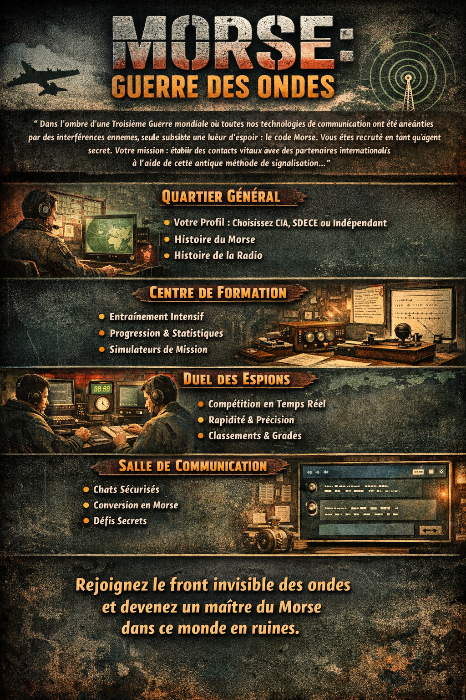

  

# Morse War – Plateforme de Communication et Compétition en Morse

**Morse War** est une plateforme web immersive destinée aux **agents secrets** et aux amateurs de **code Morse**.  
Dans un contexte de **troisième guerre mondiale**, toutes les communications modernes sont interrompues.  
Les agents des différentes agences doivent utiliser le **code Morse** pour transmettre des informations critiques.  
Le projet combine **apprentissage**, **jeu**, **compétition** et **communication en temps réel**.

---

## 1. Contexte et page d’accueil

- **Contexte** :  
  - Vous êtes un agent recruté en pleine guerre mondiale.  
  - Les communications classiques sont coupées.  
  - Seul le Morse reste fiable pour transmettre des messages secrets.  

- **Page d’accueil** :  
  - Profil de l’agent : nom, avatar, agence (CIA, SDECE, agence indépendante)  
  - Histoire du Morse et de la communication radio  
  - Tableau de progression et notifications  
  - Introduction à la mission et au contexte mondial  

---

## 2. Formation

- Exercices individuels pour **maîtriser le code Morse**  
- Niveaux de difficulté progressifs  
- Visualisation des performances :  
  - Graphiques de vitesse et précision  
  - Historique des scores  
- Possibilité de revoir les erreurs et de répéter les exercices  
- Mode **apprentissage guidé** pour débutants  

---

## 3. Duel entre agents

- Mode **multijoueur en temps réel**  
- Objectif : **décrypter un message Morse plus rapidement et plus précisément que l’adversaire**  
- Classement basé sur :  
  - Temps de décryptage  
  - Précision  
- Historique des duels et badges pour récompenser les meilleurs agents  

---

## 4. Communication

- Chat box intégré  
- Messages en texte normal ou convertis en **Morse**  
- Défis personnalisés : envoyer des messages secrets à d’autres agents  
- Notifications en temps réel pour les nouveaux défis et messages  

---

## 5. Fonctionnalités et points

| Fonctionnalité | Description | Points |
|----------------|------------|--------|
| **Web** | Utilisation d’un framework pour frontend et backend | 2 |
| **Interaction utilisateur** | Les utilisateurs peuvent interagir avec la plateforme | 2 |
| **Gestion des utilisateurs** | Création, modification de profil et suivi de progression | 2 |
| **Jeu et expérience utilisateur** | Exercices de Morse individuels et mode compétition en ligne | 2 |
| **Joueur à distance** | Possibilité de jouer contre un autre utilisateur en temps réel | 2 |
| **Data et analytics** | Tableau de bord avec visualisation des données | 2 |
| **Export / import des données** | Exporter et importer les résultats ou exercices | 2 |
| **Défis personnalisés** | Envoyer des messages codés à d’autres utilisateurs | 1 |
| **Historique des parties** | Consulter ses performances passées | 1 |
| **Classements et badges** | Récompenses pour rapidité et précision | 1 |
| **Notification en temps réel** | Pour nouveaux défis et messages | 1 |
| **Mode apprentissage guidé** | Tutoriels interactifs pour débutants en Morse | 1 |

> Total : 20 points

---

## 6. Technologies envisagées

- **Frontend** : React, Vue ou similaire  
- **Backend** : Node.js, NestJS ou Django  
- **Communication temps réel** : WebSocket / WebRTC  
- **Base de données** : PostgreSQL ou SQLite  
- **Visualisation et analytics** : graphiques et dashboards interactifs  

---

## 7. Architecture générale
<pre>
Frontend (Web)
↓
WebSocket / HTTP API
↓
Backend Server
↓
Base de données <pre>
  
- Le frontend gère l’interface immersive, les exercices et le duel en temps réel  
- Le backend gère la logique des exercices, les scores, les messages et les défis Morse  
- WebSocket ou WebRTC pour la communication et le duel multijoueur  

---

## 8. Objectifs du projet

- Apprentissage du **code Morse** de manière ludique et immersive  
- Simulation réaliste de communication d’agents en situation de crise  
- Compétition et suivi des performances  
- Expérience immersive avec **rôle d’agent secret** et contexte de guerre  

---

## 9. Extensions possibles

- Missions secrètes quotidiennes à résoudre en Morse  
- Historique complet des missions et duels  
- Système de badges et niveaux pour chaque agence  
- Mode solo avec intelligence artificielle comme adversaire  
- Visualisation des messages Morse en temps réel avec effet “radio vintage”
  
    
